## Bluemoon

First things first I'll do a scan of my home network to identify the Bluemoon server with Nmap.

```nmap -sP 192.168.1.254/24 ```

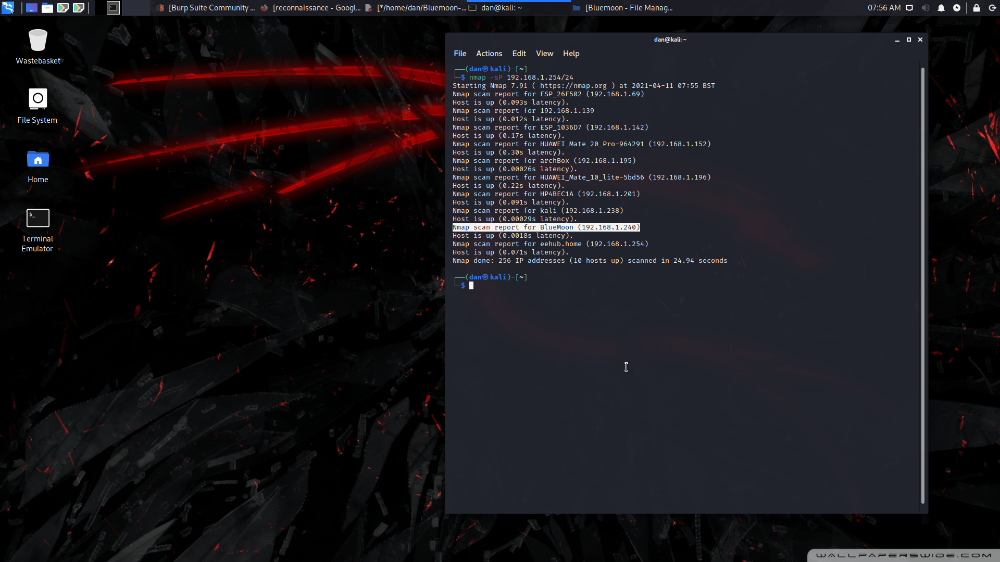


After I find the IP of my victim, my next step is reconnaissance, I'll start an Nmap scan with my current goto 
switches and see what I get.

```nmap -sV -sT -sC -A --top-ports 100 192.168.1.240 >> Scan.txt```

```cat Scan.txt```

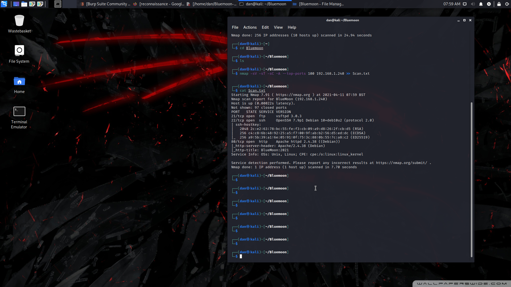


Now I know the server is running ftp and a website at port 80, My next steps are to inspect the site, check 
service versions against exploitdb and run a directory crawl on the website to see if we get anything. I'll 
check out the website first so I can leave gobuster running in the background. Doesn't seem to be anything 
interesting here so I'll let Gobuster do it's thing and come back shortly.

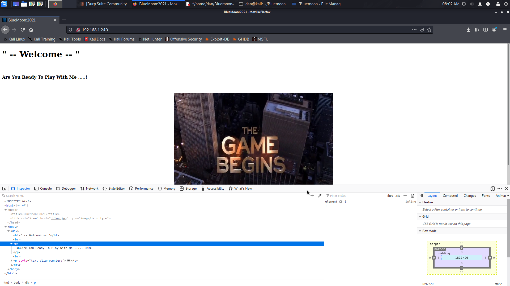


I start the gobuster scan and leave it be.

```gobuster dir -u http://192.168.1.240 -w /usr/share/wordlists/dirbuster/directory-list-2.3-medium.txt```

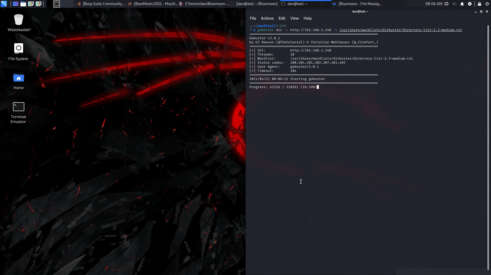


I launch metasploit and search for a vulnerability with FTP, no luck there and I notice my gobuster scan has 
already finished.

```msfconsole```
```search vsftpd```
```searchsploit vsftpd```

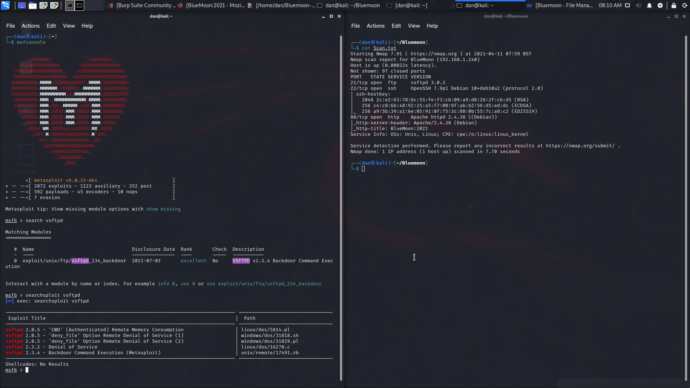


Gobuster only returned two results, /server_status returned a 404 and /hidden_text brings me this.

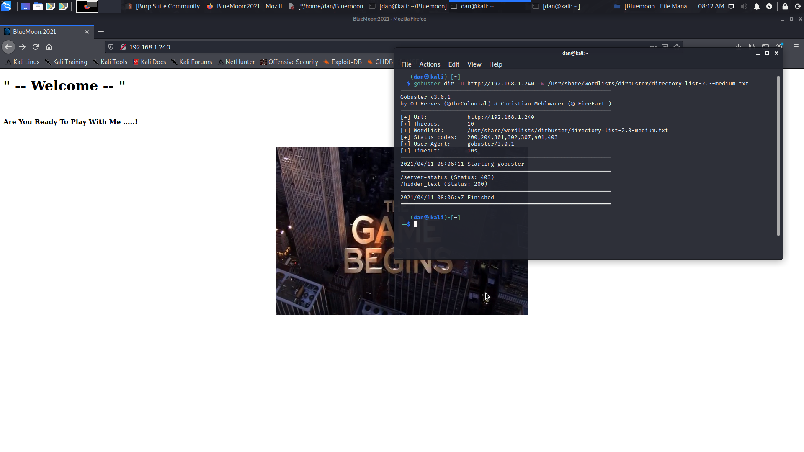

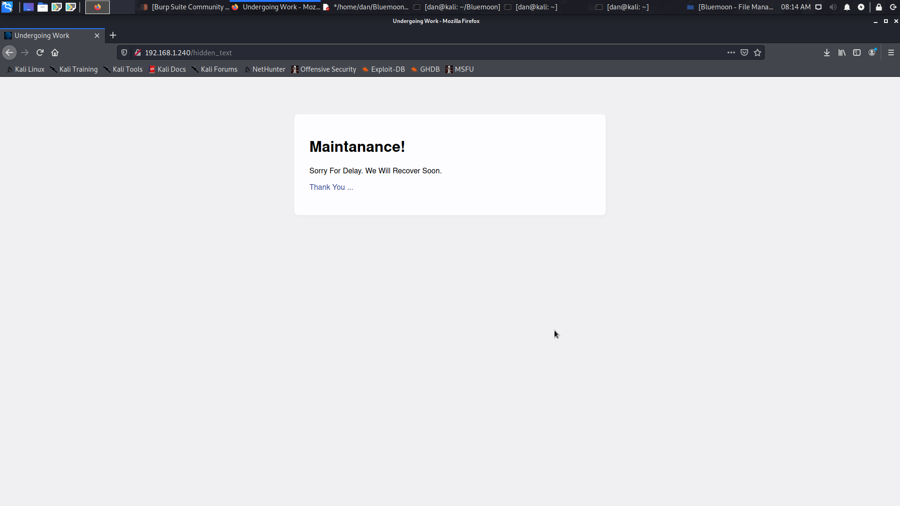


The link brings me to a qr code that i'll screenshot and check online.

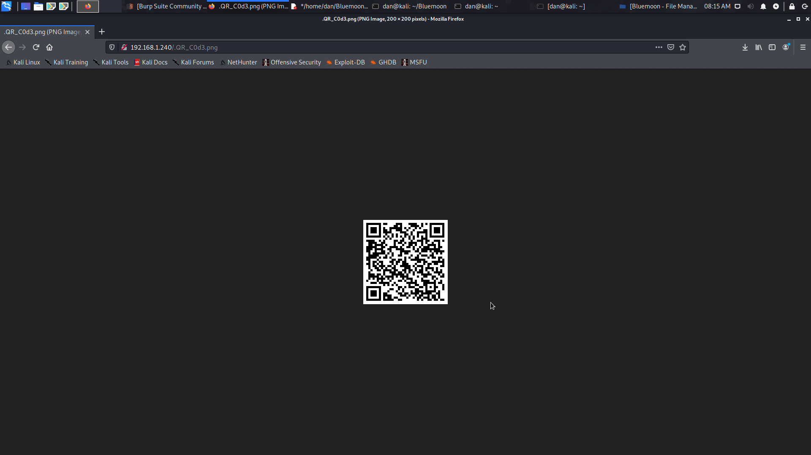


So it appears it contains the username and password for an FTP account,

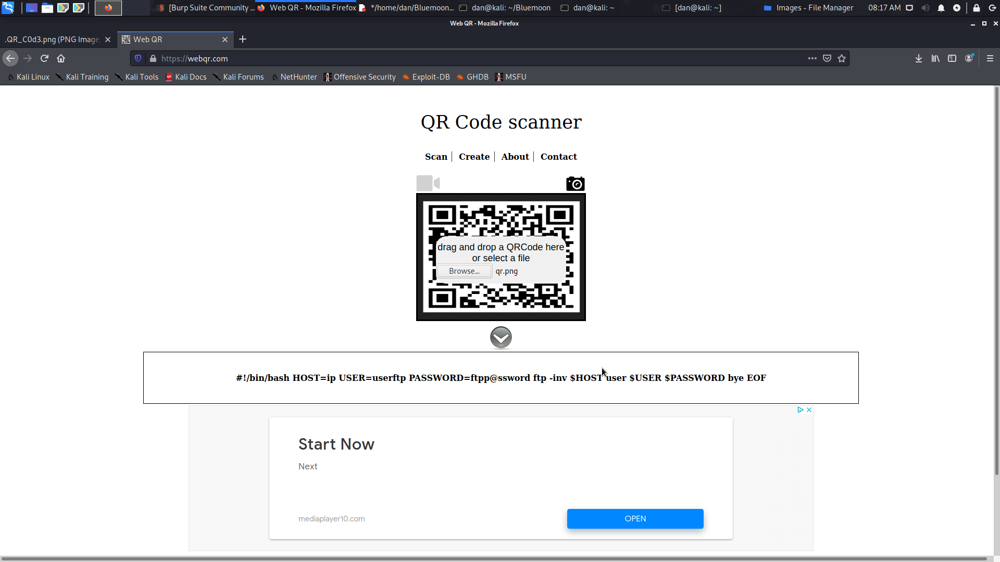


Sure enough that works to login so it's time to poke about.

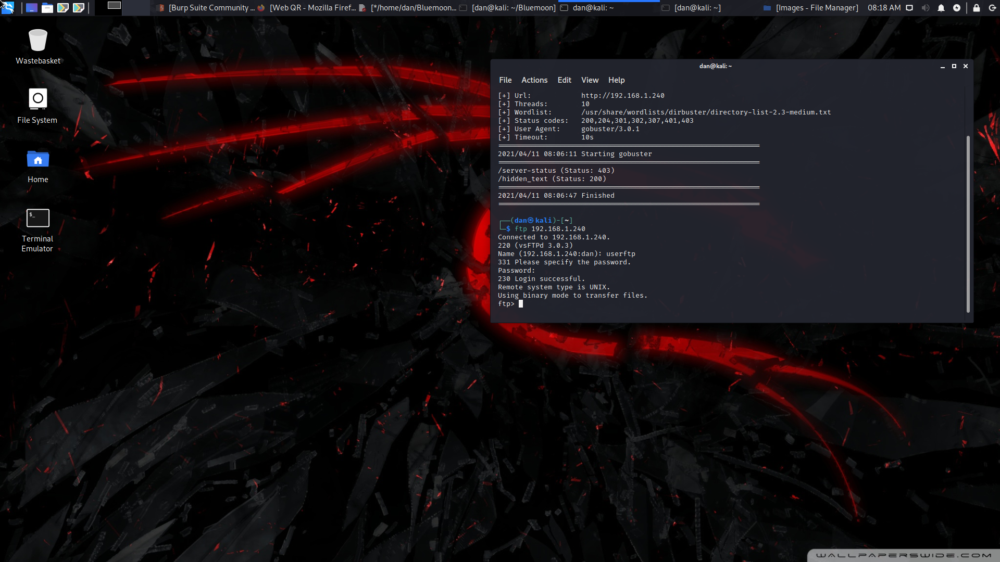


I get the two files in the userftp directory that appear to be a note from the sysadmin to someone called
robin asking them to choose a password from the provided password list p_lists.txt 

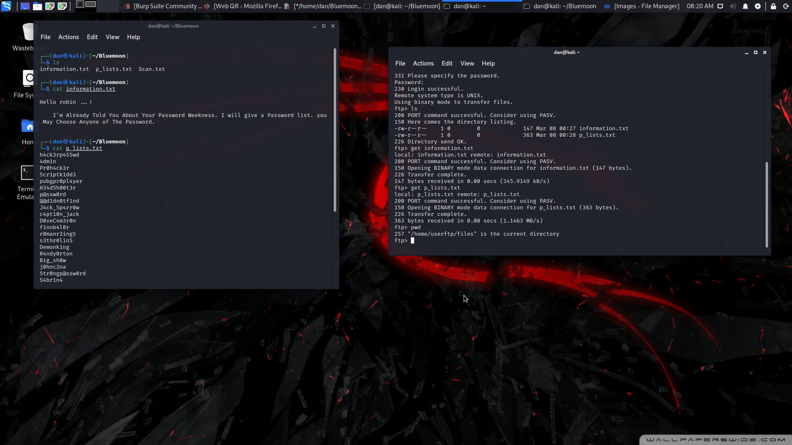


I go back a directory and see two home folders 'Robin' and 'Jerry'. Since the password list isn't very
long at all, I'll start a brute force SSH login on the Robin account.
I start a scan with scanner/ssh/ssh_login on metasploit and pass the name and password list to it.
```msfconsole```
``` use auxilary/scanner/ssh/ssh_login```

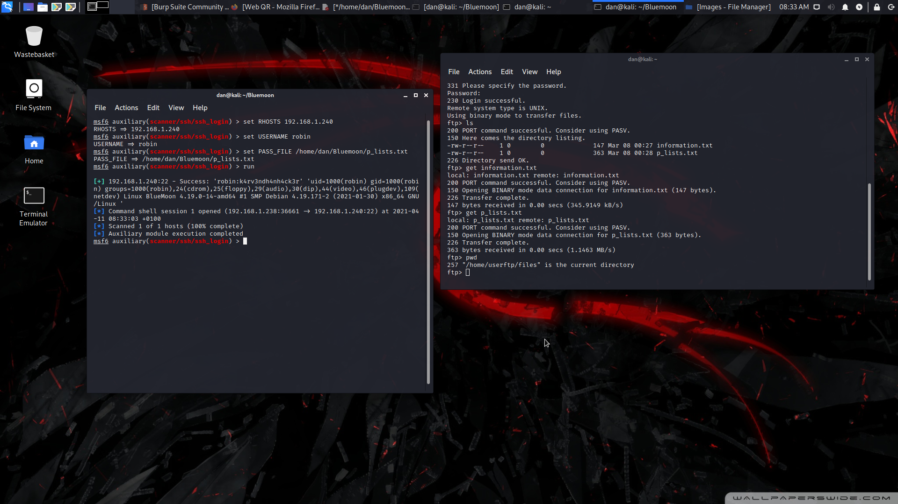


I get the password for robin! I'll make a notes.txt and put this in there along with the FTP login.

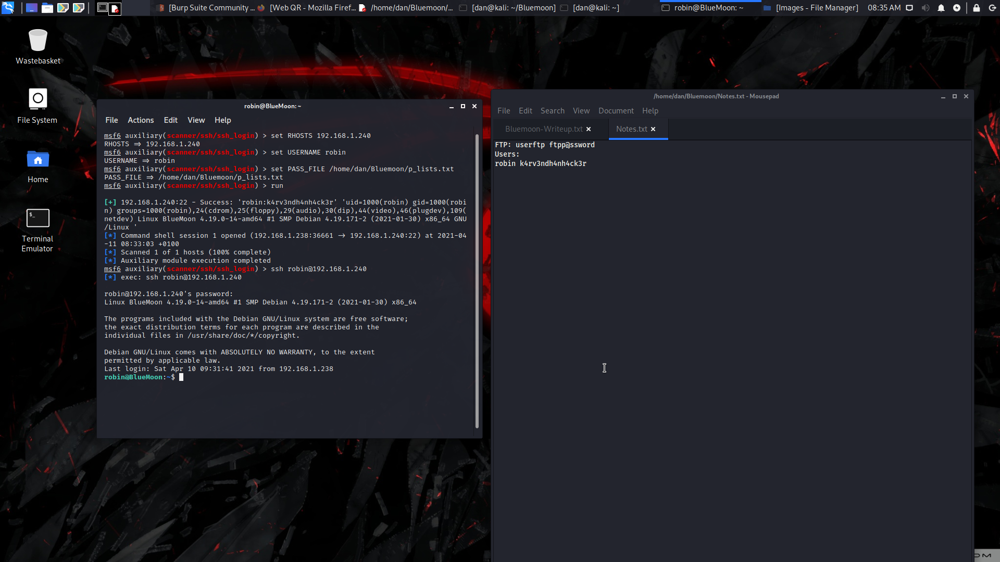


After inspecting robins home directory I get the first Flag! I'll make a note of thise and inspect the
'project' directory.

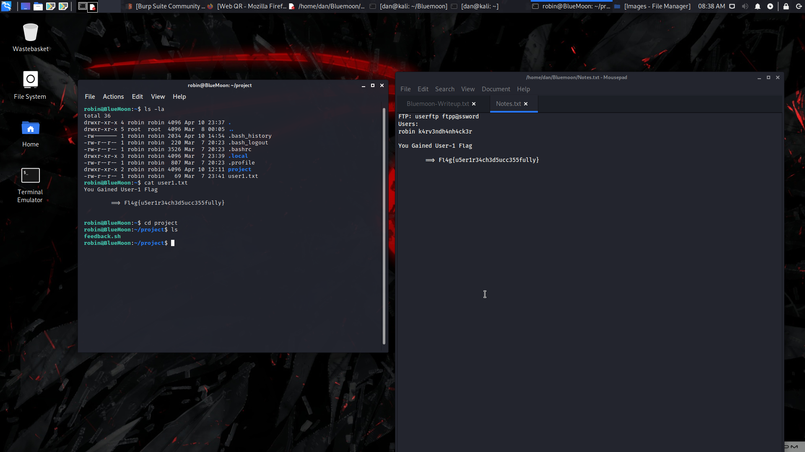


I find a bash script feedback.sh, after running sudo -l I see I can run this as Jerry without a password. I 
delete the content from the script and replace it with /bin/bash -i to try and launch a session as Jerry.

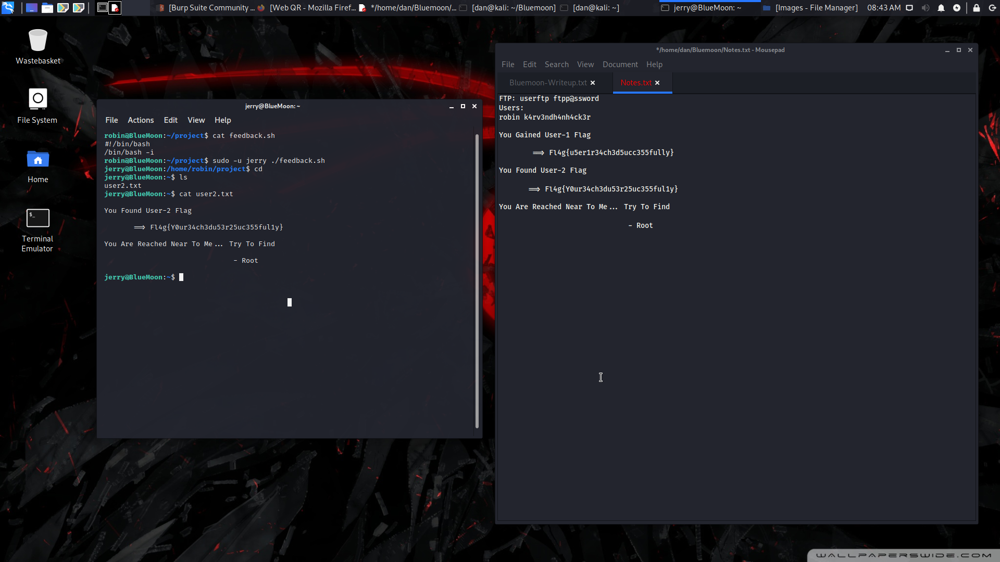


It worked and i've now got the second flag.
I see that jerry is in the docker group and check for docker images, I find one and try and mount / to /mnt of 
alpine to get a root shell. It worked! I'm root!

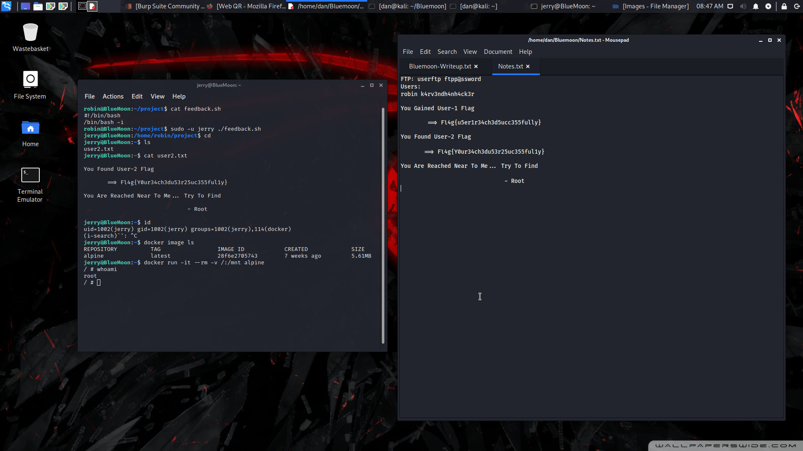


Now time to get that root flag and call it a day :)

``` docker run -it --rm -v /:/mnt alpine ```

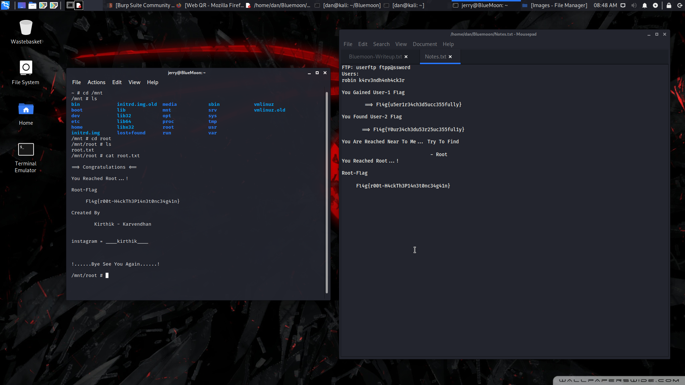


We've got the flag! I really enjoyed this box and I'll be posting more write-ups soon. Bye for now!


