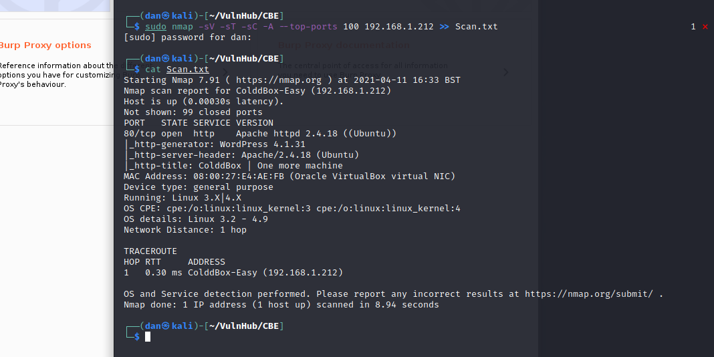
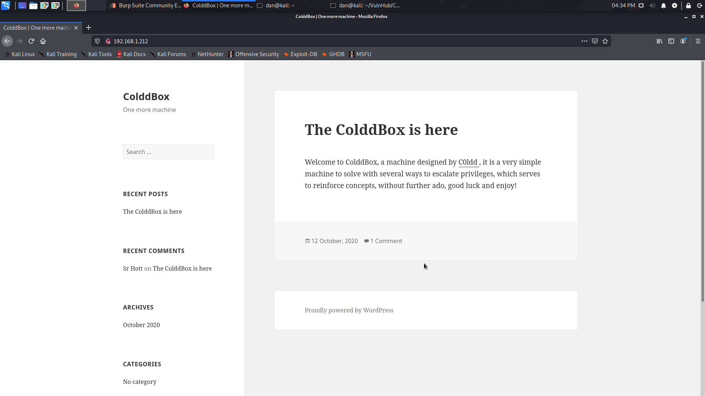
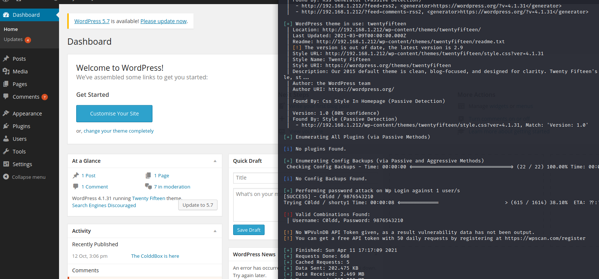
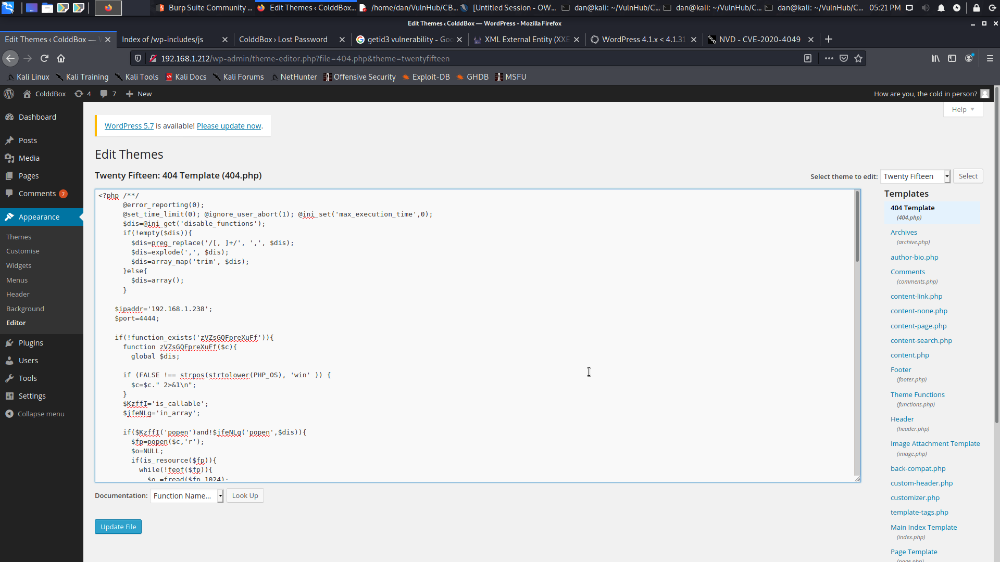
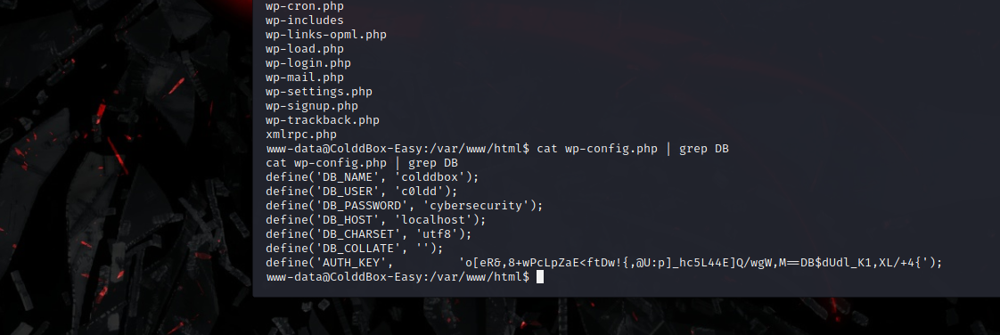

## Cold Box Easy
### Vulnhub
Date: 13/04/2021


As always I'll start off with a Nmap scan of the network to identify the IP of my target, then I hit the server with Nmap and the usual flags

```nmap -sV -sT -sC -A --top-ports 100 192.168.1.212 >> Scan.txt```

```cat Scan.txt```



It's hosting a site at port 80 and it's identified it as a wordpress site. My first thought is to use ```wpscan``` to find vulnerabilities but I'll inspect the website first to see if there are any obvious clues.



Right off the bat the creator has given us their username so I'll use ```wpscan``` to brute force the site login.


We've found the password and it's an admin account. From here there are multiple ways we can pop a shell back to the server. I'm going to create a reverse php shell with ```msfvenom``` and replace the 404 template with our generated php shellcode. Now we can run ```nc -lvp IP PORT``` and visit a path that doesn't exist. Once I've got the shell I ```cat``` the wp-config and ```grep``` for DB.




Let's try and SSH into the server with those credentials... It worked! Now I'm going to get the user flag and copy it into my notes.
[!9](Images/9.png)

I run ```sudo -l``` to see if c0ldd can execute anything as root, they can! I'm going to to use ```vim``` to edit ```/etc/sudoers``` and add that c0ldd can use root with no password ```c0ldd	ALL=(root) NOPASSWD:ALL```.
[!10](Images/10.png)
[!11](Images/11.png)
Now I use ```sudo -i``` to launch a root shell and get the root flag.
[!12](Images/12.png)


