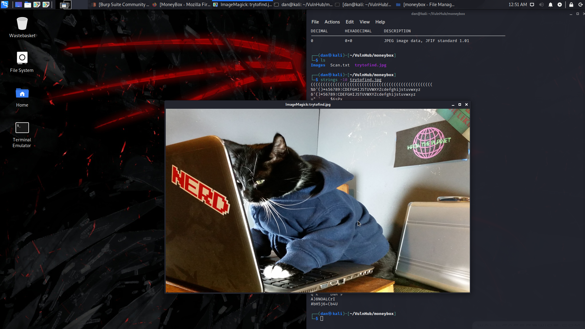

## Moneybox
### Vulnhub
Date: 15/04/2021


The initial Nmap scan shows me that SSH, FTP and HTTP are present on this machine

```nmap -sV -sT -sC -A --top-ports 100 192.168.1.212 >> Scan.txt```

```cat Scan.txt```


The results also inform me of the anonymous acount being available on FTP, I login to that and grab an image 'trytofind.jpg'


I'll do some steganography tricks on the picture but first I'll check out the website.


Nothing interesting so I'll quickly check the photo for strings longer than 10 chars and run gobuster on the website.




It only found one directory ```/blogs```, I visit that path and it takes me to another path ```s3cr3t-T3xt```.
This path gave me a 'secret key'. 


I'll try to extract data from the image with steghide. I get a text file informing me of the usrname ```renu``` and the fact that they have a weak password. I decided to try and bruteforce their SSH login and I got the password! ```987654321```


I got the first user flag and was able to ```cd``` into another user ```lily```'s home directory and get the second user flag


after poking around in some files I looked into the ```.bash_history``` and noticed renu has a key to SSH into lily's account. ```ssh -i id_rsa lily@localhost``` worked.


I then checked if lily could execute anything as root and they can run perl as root!. All i have to do now is write a small perl script to launch ```/bin/bash``` and execute that script as root.


Now we have the root flag :)


